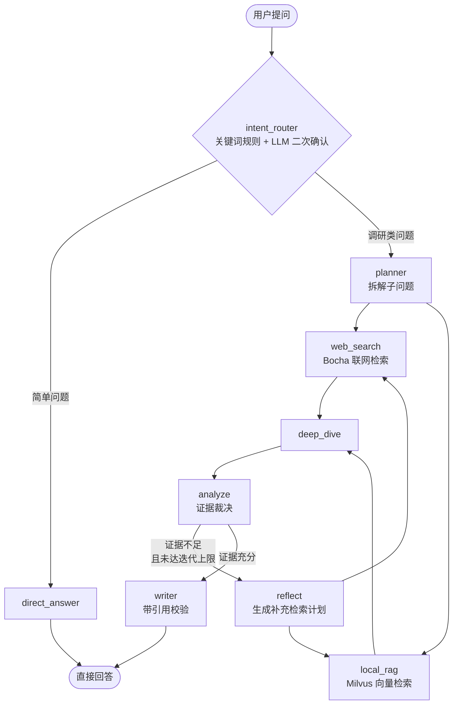

# DeepResearch · 多智能体深度研究系统

基于 LangGraph 的多智能体研究助手。输入一个开放式问题，自动走完 **意图识别 → 规划 → 双路检索 → 深度分析 → 反思迭代 → 报告生成** 全流程，输出带可追溯来源的研究报告。

技术栈：Python · LangGraph · LangChain · DashScope(Qwen) · Milvus · Bocha · FastAPI · Vue 3

---

## 一、架构

**Pipeline（串行阶段）拓扑**，8 个 Agent 串联，中间嵌一个带硬上限的反思循环。



- **8 个 Agent**：`intent_router`、`planner`、`scout_web`、`scout_local`、`evidence_judge`、`analyst`、`direct_responder`、`writer`
- **反思循环硬上限**：由 `MAX_ITERATIONS` 控制（默认 3），防止无限重搜
- 图定义见 `app/mult_agents/graph.py`，节点逻辑见 `app/mult_agents/nodes.py`

---

## 二、设计要点

### 1. 零工具模式（Agent 不绑定工具）

所有 Agent 通过 `create_agent(tools=[])` 创建，**不注册任何 LangChain 工具**。实际的检索动作由节点函数直接调用 `tools.py` 里的普通 Python 函数完成。

这样做的收益：LLM 只负责它擅长的部分（判断、归纳、生成），而参数拼装、异常处理、重试、超时全部留在确定性的 Python 里。Agent 在这里的角色是**结构化输出解析器**，不是 tool-calling agent。

### 2. 证据可追溯，防止编造引用

每次检索都记录 `web_search_trace` / `local_rag_trace`，包含 `raw_source_ids`、`kept_source_ids`、`rejected_source_ids`。`writer` 节点会校验生成的引用是否落在 `valid_source_ids` 集合内 —— 模型引用了不存在的来源会被拦下。

### 3. 每个 LLM 节点都有降级路径

所有调用 LLM 的节点都配有对应的 Python 降级函数（`_fallback_analysis`、`_fallback_audit` 等）。即使模型返回格式错误的 JSON，Pipeline 仍能产出完整报告，而不是抛异常中断。

### 4. 39 字段的共享状态

`ResearchState` 在阶段之间显式传递所有中间产物（`plan`、`web_evidence`、`audit`、`evidence_pool`、`analysis`、`draft`…）。

这是 Pipeline 模式的固有代价：阶段之间没有隐式上下文，**每一处交接都必须建模成状态字段**。对比 Router 模式只需要的少数几个字段，这个差异来自拓扑本身，不是设计冗余。

### 5. 消息不跨节点累积

`_invoke_json_agent()` 每次只把当前节点的 `HumanMessage` 传给模型（外加 `with_memory_context()` 注入的记忆段落），不累加上游节点的对话历史。目的是控制 Token 消耗，并让模型专注于当前节点单一任务。

### 6. 双层记忆 + 多后端降级

- **短期**：对话缓冲，超过 `SHORT_TERM_MAX_MESSAGES`（默认 30）后由 LLM 递归压缩为摘要
- **长期**：语义记忆（事实、用户画像）+ 情景记忆（任务历史）
- **降级链**：Postgres → Redis → SQLite/内存，逐级回退
- **Checkpointer**：支持长任务中断后续跑

---

## 三、快速开始

### 环境要求

Python 3.10+、Node.js 18+。需要 DashScope API Key（必填）；Milvus 与 Bocha 可选。

### 后端（FastAPI · 端口 8000）

```bash
cd deep_research

cp .env.example .env
# 编辑 .env，至少填写 DASHSCOPE_API_KEY
# 如需联网检索，再填 BOCHA_API_KEY

pip install -r requirements.txt

python main.py            # CLI 交互模式
python main.py --once-query "你的问题"   # 单次执行
python app/app_main.py    # API 服务模式，监听 0.0.0.0:8000
```

### 前端（Vite · 端口 5173）

```bash
cd front/agent_front
npm install
npm run dev
```

前端 dev server 已配置代理，`/api` 请求会转发到 `http://127.0.0.1:8000`。

### 知识库入库（可选，需要 Milvus）

`local_rag` 节点从 Milvus 的 `MILVUS_RAG_COLLECTION` 集合检索（与长期记忆用的 `MILVUS_COLLECTION` 是两个集合，互不干扰）。把本地文档灌进去：

```bash
python app/mult_agents/rag/ingest.py <文件或目录>   # 目录会递归收集 *.txt/*.md/*.markdown
python app/mult_agents/rag/ingest.py data/corpus --chunk-size 300   # 换分块粒度
```

不灌数据时 `local_rag` 检索为空，Pipeline 会靠 Bocha 联网检索这一路继续跑通。

### 配置优先级

**环境变量 > `config.json` > 代码默认值**（实现见 `app/mult_agents/config.py` 的 `_resolve_str`）。

`config.json` 可覆盖：模型名、最大迭代次数、记忆后端、Milvus 开关、Checkpointer 后端。

---

## 四、评测

项目自带一套可复跑的评测，用来量化"检索链路修复到底有没有带来改进"，而不是靠感觉描述。

### 组成

| 文件 | 作用 |
|------|------|
| `data/eval/eval_set.jsonl` | 50 道题（q36 因内容审核拦截排除，49 道有效），分 5 类（机理 12 / 对比 10 / 综述 10 / 政策 10 / 参数 8），每题标注 ground truth 语料文档 |
| `data/eval/verify_eval_set.py` | 出题阶段校验：ground truth 文件存在性 + 检索召回 Recall@1/3/5 + 证据多样性 |
| `data/eval/run_eval.py` | 跑完整流水线并导出 JSONL：token 用量折算成本、降级节点数、审核拦截数、非法引用数 |
| `data/eval/score_runs.py` | LLM-as-judge 打分：忠实度（claim 级）+ 相关性 |
| `data/corpus/` | 73 篇能源领域语料，每篇首行带维基来源 URL |
| `data/eval/results/` | 原始打分输出 —— 本节两张表的数据来源，未编辑（含每题被判不支持的论断原文） |

```bash
python data/eval/verify_eval_set.py                                  # 校验题目与检索召回
python data/eval/run_eval.py --ids q01,q11,q13 --output data/eval/runs/runs.jsonl
python data/eval/score_runs.py --input data/eval/runs/runs.jsonl
```

`run_eval.py` 会识别三类需要人工留意的记录并响亮标记：`BYPASSED`（题目被路由到 `direct_answer`，零检索零引用，对评测无效）、`FALLBACK`（产出的是降级报告）、审核拦截（证据池混入未经过滤的原始语料）。

### 为什么不用 Ragas

项目 pin 的是 langchain 1.x 线（langchain 1.0.7 / langchain-core 1.0.5）。`ragas 0.4.3` 在 `ragas/llms/base.py` 里 import `langchain_community.chat_models.vertexai.ChatVertexAI`，而该类在 langchain-community 0.4.x 已被拆成独立的 `langchain-google-vertexai` 包 —— **能装上，一导入就崩**；装进独立 venv 也没用，ragas 自己会拉一套 langchain。因此改为自建 LLM-as-judge：每题 3 次调用（论断抽取 / 忠实度判定 / 相关性），约 ¥0.04/题。

### 实测结果

修复检索链路（此前 planner 生成的大纲检索词因中文分词失效**从未真正进入检索计划**，检索长期只靠硬编码模板词在跑）前后，取 7 题覆盖四类做对照：

| 题 | 类别 | 忠实度 旧 → 新 | 相关性 旧 → 新 |
|---|---|---|---|
| q01 | 机理 | 0.083 → 0.125 | 0.95 → 0.98 |
| q11 | 机理 | 0.083 → 0.167 | 0.95 → 0.85 |
| q13 | 对比 | 0.000 → 0.292 | 0.85 → 0.95 |
| q18 | 对比 | 0.417 → 0.750 | 0.95 → 0.95 |
| q23 | 参数 | 0.625 → 0.542 | 0.95 → 0.95 |
| q25 | 参数 | 0.583 → 0.792 | 0.95 → 0.95 |
| q41 | 综述 | 0.000 → 0.250 | 0.95 → 1.00 |
| **平均** | | **0.256 → 0.417** | 0.936 → 0.947 |

6/7 题上升（唯一例外 q23 微降）。检索命中率 100%、引用合规率 1.000，两侧一致。单题成本从 ¥0.055 涨到 ¥0.13 —— 修复后每轮真的会发出 6 条补搜词（旧逻辑永远只发 1 条），**修 bug 让评测变贵而不是变便宜**。

**两点诚实说明：**

1. **忠实度绝对偏低，有相当部分来自指标与设计目标的冲突。** `write` 提示词明确要求"深度扩写、逻辑推演、至少 2000–3000 字"，而推演出来的内容按定义不在检索证据里，会被 judge 判为 unsupported —— **这个指标惩罚的正是系统被要求做的事**。要真正提高它得改 `write` 提示词（收紧扩写、要求逐句挂证据），那是另一个取舍。旧版拿到 0.000 的两题则是真缺陷：检索被模板词带偏（搜到「台湾再生能源… GitHub」这类无关内容），writer 手上没有相关证据，只能靠参数化知识写，引文挂上了（合规率仍是 1.0）但内容撑不住 —— **引用合规率高 ≠ 内容有据**。
2. **样本量小，只能作方向性结论。** 方差大（0.0–0.792），可以说"方向一致、幅度可感（相对 +63%）"，不能说"已证明提升 X%"。

### 分块粒度对照

同一批语料按 3 种 `chunk_size` 各灌一个集合，**只在检索层比**（忠实度被扩写要求污染，分辨不出粒度差异）：

| chunk_size | chunk 数 | Recall@1 | Recall@3 | Recall@5 |
|---|---|---|---|---|
| 300 | 1253 | 81.6% | 98.0% | 100.0% |
| **500（默认）** | 688 | **87.8%** | 98.0% | 100.0% |
| 800 | 411 | 75.5% | 95.9% | 98.0% |

结论：**chunk_size 不是召回瓶颈。** 300 与 500 在 Recall@3/5 上完全相同，差别只体现在 rank-1（最相关的那片排不排第一），而下游 `scout` LLM 读的是 top-k 全量并筛选，这个差异被吃掉了；默认值 500 恰好是三档里最好的。800 最差 —— chunk 越大，单个分片语义越稀、专指性越弱。复跑方式：

```bash
MILVUS_RAG_COLLECTION=mult_agent_knowledge_c300 \
  python app/mult_agents/rag/ingest.py data/corpus --chunk-size 300
MILVUS_RAG_COLLECTION=mult_agent_knowledge_c300 python data/eval/verify_eval_set.py
```

### 两条使用约束

- **题目必须含调研型措辞**（"请分析 / 对比 / 调研…"）。短事实问句会被 `detect_intent()` 判为简单问题走 `direct_answer`，全程零检索零引用，测的根本不是这条流水线。
- **`q36`（核电存废）已从评测集排除**：DashScope **输出端**内容审核对该题系统性命中（单轮 9 次调用中 8 次被拦），拿不到未被污染的证据。审核拦的是模型生成的内容，输入不变则重跑结果不变，再试只是白烧钱。该条在 `eval_set.jsonl` 里保留 `excluded: true` 与原因，两个脚本会自动跳过。

---

## 五、目录结构

```
app/
├── mult_agents/          # LangGraph 核心
│   ├── graph.py          # StateGraph 构建：节点、条件边、反思循环
│   ├── nodes.py          # 9 个节点函数
│   ├── state.py          # ResearchState（39 字段）
│   ├── prompts.py        # 8 个系统提示词，与 8 个 Agent 一一对应
│   ├── tools.py          # Bocha 检索、Milvus RAG 封装
│   ├── config.py         # AppConfig 不可变 dataclass
│   ├── memory/           # 双层记忆 + 多后端降级链
│   └── rag/              # 向量检索核心 + ingest.py 入库 CLI
├── backend/              # FastAPI 层
│   ├── router/           # /health、/api/v1/research
│   ├── service/          # WorkflowService，支持同步与 SSE 流式
│   └── schemas/          # 请求/响应模型
└── app_main.py           # API 服务入口

front/agent_front/        # Vue 3 前端（SSE 流式渲染）

data/
├── corpus/               # 73 篇能源领域语料，每篇首行带维基来源 URL
└── eval/                 # 评测集与脚本（见「四、评测」）
```

---

## 六、已知限制

- **无单元测试**。`data/eval/` 覆盖的是端到端行为（见「四、评测」），不是代码级测试。项目定位是架构演示，代码质量重点在模式而非生产级健壮性。
- **完整记忆功能依赖外部服务**。Postgres / Redis / Milvus 未接入时会逐级降级到 SQLite，功能可用但非预期路径。
- **评测样本量小**。7 题对照只能支撑方向性结论，单题存在反向波动（如 q23 微降）。
- **忠实度指标与扩写要求存在张力**。`write` 提示词要求深度扩写与逻辑推演，推演内容天然不在检索证据里，会被 judge 判为 unsupported —— 忠实度偏低有相当部分来自这个设计取舍，而非纯缺陷。
- **SQLite 降级后端无并发保护**，仅适用于本地单进程使用。
